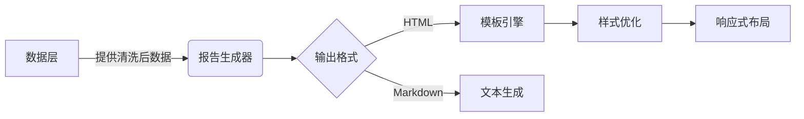

# HTML报告生成器实施计划

## 当前问题
1. KeyError: 'code' 异常
2. 缺失估值数据展示模块
3. 样式不符合Apple Design规范

## 解决方案

## 实施步骤
1. 增强StockData类数据校验
2. 实现模板继承机制
3. 添加可视化图表支持
4. 完善错误处理边界

## 测试策略
- 数据完整性测试
- 模板渲染测试
- 跨浏览器兼容性测试
- 移动端适配测试

## 风险评估
⚠️ 数据异步加载可能导致渲染延迟
✅ 解决方案：添加加载状态指示器
